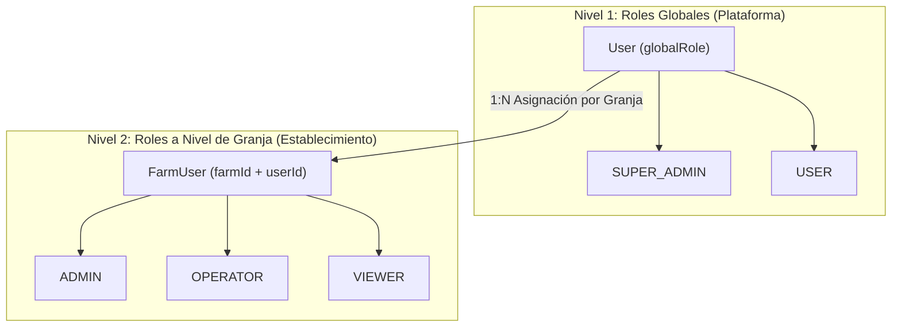
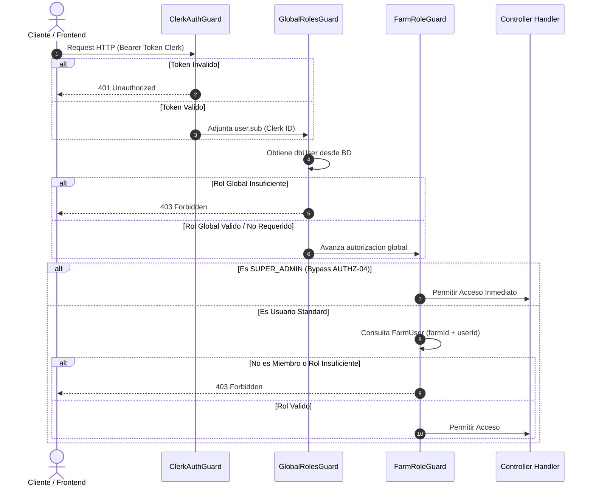

# Sistema de Roles de Dos Niveles en DAMP

Este documento describe la arquitectura, la estructura de datos y el flujo de autorización del **Sistema de Roles de Dos Niveles** implementado en la plataforma DAMP (Dispositivo de Monitoreo Animal y Posicionamiento).

---

## 1. Visión General de la Arquitectura

Para soportar una arquitectura multitenant segura (donde múltiples establecimientos rurales conviven en la plataforma), DAMP divide los permisos de usuario en **dos niveles jerárquicos independientes**:



---

## 2. Nivel 1: Roles Globales de la Plataforma (`GlobalRole`)

Los roles globales controlan el acceso a nivel de la infraestructura general del sistema y determinan si un usuario puede realizar tareas administrativas globales.

### A. Modelo de Datos (Prisma Schema)
En la entidad `User`, el campo `globalRole` utiliza el enum `GlobalRole`:

```prisma
enum GlobalRole {
  SUPER_ADMIN
  USER
}

model User {
  id         String     @id @default(uuid())
  clerkId    String     @unique @map("clerk_id")
  email      String     @unique
  globalRole GlobalRole @default(USER) @map("global_role")
  createdAt  DateTime   @default(now()) @map("created_at")
  updatedAt  DateTime   @updatedAt @map("updated_at")

  farmUsers FarmUser[]
  @@map("users")
}
```

### B. Definición de Roles
* **`SUPER_ADMIN`**: Administrador global de la plataforma DAMP. Posee acceso irrestricto a todas las granjas y al panel global de usuarios.
* **`USER`**: Usuario estándar de la plataforma (ej. productores, operadores). Requiere asignación explícita a granjas específicas para acceder a sus recursos.

### C. Decorador y Guard en Backend (NestJS)
* **Decorador**: `@GlobalRoles(GlobalRole.SUPER_ADMIN)` ([backend/src/auth/decorators/global-roles.decorator.ts](file:///home/tomas-wardoloff/Documents/Projects/damp/backend/src/auth/decorators/global-roles.decorator.ts))
* **Guard**: `GlobalRolesGuard` ([backend/src/auth/guards/global-roles.guard.ts](file:///home/tomas-wardoloff/Documents/Projects/damp/backend/src/auth/guards/global-roles.guard.ts))
* **Rutas Administradas**: `/admin/users` (Servicio `AdminUsersService` en [backend/src/admin](file:///home/tomas-wardoloff/Documents/Projects/damp/backend/src/admin))

---

## 3. Nivel 2: Roles a Nivel de Granja (`FarmUser` / `Role`)

Los roles a nivel de granja gestionan el control de acceso fino dentro del ámbito de una granja particular.

### A. Modelo de Datos (Prisma Schema)
La relación entre un usuario y una granja se establece mediante la entidad intermedia `FarmUser`:

```prisma
model Role {
  id        String   @id @default(uuid())
  name      String   @unique
  createdAt DateTime @default(now()) @map("created_at")

  farmUsers FarmUser[]
  @@map("roles")
}

model FarmUser {
  id     String @id @default(uuid())
  farmId String @map("farm_id")
  userId String @map("user_id")
  roleId String @map("role_id")

  farm Farm @relation(fields: [farmId], references: [id], onDelete: Cascade)
  user User @relation(fields: [userId], references: [id], onDelete: Cascade)
  role Role @relation(fields: [roleId], references: [id])

  @@unique([farmId, userId])
  @@map("farm_users")
}
```

### B. Roles Típicos de Granja
* **`ADMIN`**: Administrador del establecimiento. Puede invocar sub-usuarios, cambiar roles locales y remover accesos.
* **`OPERATOR`**: Operador de campo. Puede gestionar animales, actualizar pesajes y configurar zonas o geocercas.
* **`VIEWER`**: Lector. Solo puede visualizar reportes y telemetría sin permisos de edición.

### C. Bypass Jerárquico (`AUTHZ-04`)
Si un usuario con `globalRole === GlobalRole.SUPER_ADMIN` realiza una solicitud a un endpoint protegido por `FarmRoleGuard`, el guard autoriza el acceso **automáticamente**, sin requerir estar registrado en la tabla `farm_users` de dicha granja.

### D. Decorador y Guard en Backend (NestJS)
* **Decorador**: `@RequireFarmRole('ADMIN')` ([backend/src/auth/decorators/require-farm-role.decorator.ts](file:///home/tomas-wardoloff/Documents/Projects/damp/backend/src/auth/decorators/require-farm-role.decorator.ts))
* **Guard**: `FarmRoleGuard` ([backend/src/auth/guards/farm-role.guard.ts](file:///home/tomas-wardoloff/Documents/Projects/damp/backend/src/auth/guards/farm-role.guard.ts))
* **Extracción de `farmId`**: `FarmRoleGuard` resuelve de forma transparente el `farmId` desde los parámetros de la URL (`params`), cuerpo de la solicitud (`body`) o query string (`query`).

---

## 4. Flujo de Autorización y Evaluación de Guards

El siguiente diagrama detalla la ejecución secuencial de los guards en las peticiones HTTP al backend:



---

## 5. Componentes del Frontend (Next.js App Router)

El frontend incluye vistas dedicadas para la administración de ambos niveles de roles:

| Nivel de Rol | Ruta de Vista | Componente React | API Proxy |
| :--- | :--- | :--- | :--- |
| **Global** | `/admin/users` | `AdminUserList.tsx` | `/api/admin/users` |
| **Granja** | `/farms/[id]/users` | `FarmUserList.tsx` | `/api/farms/[farmId]/users` |

* **`AdminUserList`**: Permite alternar entre los roles `USER` y `SUPER_ADMIN` para cualquier usuario registrado.
* **`FarmUserList`**: Permite asignar nuevos sub-usuarios a una granja por correo electrónico, actualizar sus roles (`ADMIN`, `OPERATOR`, `VIEWER`) y revocar permisos.

---

## 6. Endpoints de la API REST

### A. Administración Global (`/admin/users`)
* `GET /admin/users`: Obtiene el listado completo de usuarios y el conteo de granjas vinculadas.
* `PATCH /admin/users/:userId/role`: Modifica el `globalRole` del usuario objetivo.

### B. Administración de Granja (`/farms/:farmId/users`)
* `GET /farms/:farmId/users`: Lista los integrantes registrados en la granja con su rol asignado.
* `POST /farms/:farmId/users`: Agrega un sub-usuario a la granja por `userId` o `email` (Requiere rol `ADMIN`).
* `PATCH /farms/:farmId/users/:userId`: Cambia el rol de un sub-usuario en la granja (Requiere rol `ADMIN`).
* `DELETE /farms/:farmId/users/:userId`: Revoca el acceso de un sub-usuario a la granja (Requiere rol `ADMIN`).
